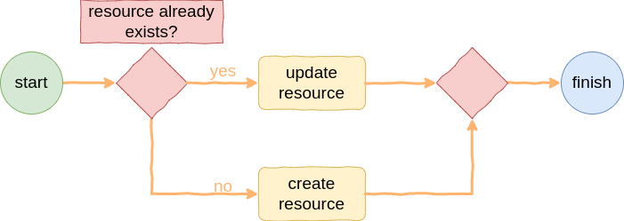
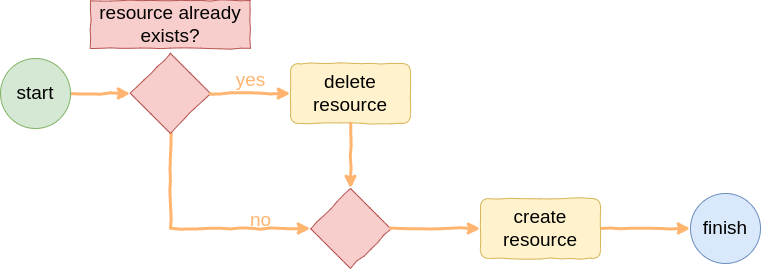

# Octopus

Octopus is made to setup anything in a simple way. It could be understood as an alternative to [Terraform](https://github.com/hashicorp/terraform), [Pulumi](https://github.com/pulumi/pulumi), etc. Octopus can operate systems by their own APIs (like Terraform do), but without need to keep any separated state (such as [`.tfstate` file](https://developer.hashicorp.com/terraform/language/state)). All infrastructure state is the configuration files, it makes operation more simpler than Terraform. With Octopus the configuration files is the source of truth.


Octopus is completely written in JavaScript and uses the [Handlebars](https://github.com/handlebars-lang/handlebars.js/) powers to provide a template language. Octopus is extensible, [supports additional plugins](#creating-a-plugin) and has some [built-in helpers](#built-in-helpers) to do common things like reading file contents, reading environment variables, and so on.

## How to use it?

To use Octopus, the first thing is to understand how does the [lifecycles](#lifecycles) works. After that, it is necessary to choose a [plugin](#plugin-list) and specify the plugin resources by writing configuration files. It is possible to use [helpers](#built-in-helpers) to write configuration files too.

At last the follow command can be executed:

```bash
docker run -it --rm \
    -e MY_ENV=${MY_ENV} \ 
    -v ./project:/project \
        infralake/octopus:1.0.0 \
            path=/project \
            format=<format> \
            plugin=<plugin> \
            api=<api> \
            recreate=<recreate>
```


### Lifecycles

The main objective of defining the Octopus lifecycles is to make a standard operation, independent of each system and, at the same time, respecting its particularities. 

#### Basic Lifecycle

The basic lifecycle is:


The `plugin config` step sets the plugin helpers and load the plugin environmment variables, this step is most relevant for plugin developers. After that Octopus trigger the `plugin run` step that runs the [basic plugin run lifecycle](#basic-plugin-run-step-lifecycle) steps.

#### Basic Plugin Run Step Lifecycle

The basic plugin run step lifecycle steps consists of the following steps:


The `load resources` step reads and parse the configuration files and the `sync resources` step sets up the resource on the target infrastructure according to the parsed configuration files. There are two ways to sets up the infrastructure that is explained [here](#sync-resources-lifecycles).

Each plugin respects the resource creation order. Resource creation order is the plugin intelligence that sets the creation precedence between resource types so Ocopus users don't need to worry about it. The plugin abstracts this complexity in order to simplify usability.

#### Sync Resources Lifecycles

There are two ways to sync resources that is represented by the follow lifecycle types:

1. [Update Resources Lifecycle](#update-resources-lifecycle): Used to keep already created resources and just modify them as per config file data. It is enabled by default or when setting the `recreate="false"` argument; or 
2. [Recreate Resources Lifecycle](#recreate-resources-lifecycle): Used to recreate resource on every execution. It is enabled when setting the `recreate="true"` argument.

Some plugins could not support `recreate="false"` lifecycle, this infomation can be found at the plugin docs.  

#### Update Resources Lifecycle

The lifecycle of update resources (used by default) has the following lifecycle for each resource:



It is very important to understand that each configuration file represents a resource and the image above represents the execution lifecycle of each resource (configuration file).

The `resource already exists?` step checks if the resource has already been created and runs the `update resource` step if true or the `create resource` step if not.

This lifecycle is enabled by default or when is explicitly set the `recreate` parameter to `false`.

#### Recreate Resources Lifecycle

The lifecycle of recreate resources has the following lifecycle for each resource:



It is very important to understand that each configuration file represents a resource and the image above represents the execution lifecycle of each resource (configuration file).

The `resource already exists?` step checks if the resource has already been created and runs the `delete resource` step if true or the `create resource` step if not.

This lifecycle is enabled when sets the `recreate` parameter to `true`.

### Plugin List

Nowadays Octopus supports operation for these systems as plugins:

|**System**|**Plugin**|**Description**|**Docs**|
|-|-|-|-|
|[Airbyte](https://airbyte.com/)|`airbyte`|Read `workflows` and Manage `sources`, `destinations` and `connections` by [Airbyte Cloud API](https://reference.airbyte.com/reference/start). It is an alternative for the official [Airbyte Octavia CLI](https://github.com/airbytehq/airbyte/tree/master/octavia-cli).|[click here](../src//plugins/airbyte/docs/README.md)|
|[Airflow](https://airflow.apache.org/)|`airflow`|Manage `variables`, `connections`, `pools`, `users` and `roles` by [Airflow API](https://airflow.apache.org/docs/apache-airflow/stable/stable-rest-api-ref.html).|[click here](../src//plugins/airflow/docs/README.md)|
|[Github](https://github.com/)|`github`|Read `workflows` by [Github API](https://docs.github.com/en/rest).|[click here](../src//plugins/github/docs/README.md)|
|[Badger](https://infra-lake.github.io/badger/)|`badger`|Manage `sources` and `targets` by Badger API.|[click here](../src//plugins/badger/docs/README.md)|

### Built-in Helpers

There are many default helpers that could be used on Octopus. Firstly, as Octopus was build on top of [Handlebars](https://github.com/handlebars-lang/handlebars.js/) it supports to use their [built-in helpers](https://handlebarsjs.com/guide/builtin-helpers.html#if) that permits to make complex configuration files using their [programing language](https://handlebarsjs.com/guide/). In addition, the following Helpers can be used:

|**Helper**|**Description**|**Example**|
|-|-|-|
|`env`|Used to read environment variables.|`{{ env.SOME_ENVIRONMENT_VARIABLE }}`|
|`file`|Used to read content of files as a text.|`{{ file "/path/to/file.json" }}`|
|`id`|Used to retrieve infrastructure id of some resource. It is important because some plugins define a natural key for a resource that create some artificial/surrogate/aleatory id. Sometimes is important to know what is the id of some resource to reference it in another configuration file.|`{{ id "some-plugin" "some-api-version" "some-resource" "some-resource-key" "some-extra-optional-filters" }}`|

Each plugin could define another helpers that should be described on the plugin docs page.

### Resources

Resources are defined by configuration files. Each configuration file sets up one resource.

## How to contribute?

We are defining this process, please take a while... 